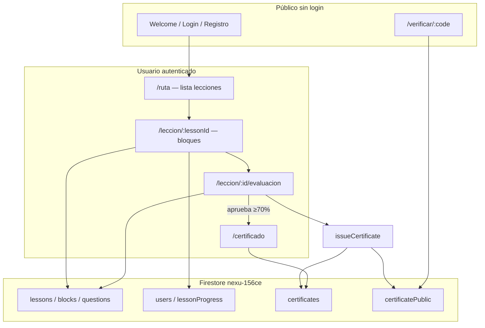

# Documentación Nexu — Índice para el equipo de desarrollo

**Empieza aquí.** Con estos archivos puedes entender la plataforma, lo que ya está hecho y lo que falta, sin depender de un solo compañero.

Proyecto Firebase compartido: **`nexu-156ce`** (misma base en local, producción Vercel y para todos los devs con permisos Owner/Editor).

---

## 1. ¿Puedo desarrollar solo con esta documentación?

**Sí**, para:

- Clonar el repo, configurar entorno y correr la app.
- Entender Firestore (lecciones, progreso, certificados).
- Cargar **nuevas lecciones** con seed (mismo proceso que lección 1).
- Mantener **certificados** (ya implementado; ver enlaces abajo).
- Saber **qué falta** y en qué archivos tocar.

**No alcanza sola** para: diseño 3D del minijuego, videos de YouTube definitivos, textos oficiales de las lecciones 2–5 (salen del PDF técnico de cada módulo, no están en el repo), ni decisiones de producto no escritas en el backlog. Esas tareas están listadas en la sección 3.

---

## 2. Mapa de documentos (orden de lectura)

| Orden | Documento | Para quién | Contenido |
|-------|-----------|------------|-----------|
| 1 | Este archivo (`docs/README.md`) | Todos | Índice, arquitectura, backlog, rutas |
| 2 | [DESARROLLO_LECCIONES.md](./DESARROLLO_LECCIONES.md) | Quien hace lecciones 2–5 | Firestore, seed, comandos CLI, bloques, preguntas |
| 3 | [CERTIFICADOS.md](./CERTIFICADOS.md) | Quien mantiene certificación | Emisión, PDF, QR, verificación (ya hecho) |
| 4 | [../firestore-seed/README.md](../firestore-seed/README.md) | Quien sube datos | Seed lección 1; plantilla lección 2+ |

---

## 3. Arquitectura en una vista



| Colección | Quién escribe | Quién lee |
|-----------|---------------|-----------|
| `lessons`, `blocks`, `questions` | **Seed** (terminal) | App (alumno) |
| `users/{uid}` | Registro | App |
| `users/{uid}/lessonProgress/{lessonId}` | App al avanzar | App |
| `certificates/{id}` | App al aprobar examen | Dueño del certificado |
| `certificatePublic/{code}` | App al aprobar examen | **Todos** (verificación pública) |

---

## 4. Estado del producto (mayo 2026)

### Listo para usar

| Módulo | Estado |
|--------|--------|
| Auth + perfil | OK |
| Lección 1 (contenido + flujo) | OK en Firestore + app |
| Progreso por bloque | OK (estructura fija lección 1) |
| Evaluación final L1 | OK |
| Certificados + PDF + QR + verificar | OK |
| Deploy frontend Vercel | OK (requiere `VITE_FIREBASE_*` y `pnpm-lock` al día) |

### Pendiente — asignar en el equipo

| Prioridad | Tarea | Archivos / notas | Depende de |
|-----------|-------|------------------|------------|
| Alta | Lección 2: JSON + seed | `firestore-seed/lesson_02/`, script seed (ver §5 abajo) | PDF técnico L2 |
| Alta | Lección 3–5 | Igual que L2 | Contenido |
| Alta | Desbloqueo lección N+1 en ruta | `LearningPathPage.tsx` — ya hay lógica parcial por `passed` | Lección anterior en Firestore |
| Media | Minijuego 3D cocina | `GameBlockView.tsx` o escena R3F | Diseño escena |
| Media | Videos YouTube reales | `blocks.json` → `youtubeUrl`; opcional % visto | Links del equipo |
| Media | Progreso **dinámico** por lección | `progressService.ts` — hoy `INITIAL_BLOCKS_PROGRESS` es fijo L1 | Lección 2+ con distinto nº de bloques |
| Media | Bloquear menú “Evaluación” hasta completar juego | `Sidebar.tsx` + leer progreso | Opcional UX |
| Baja | Cloud Function emisión certificado | `functions/` (no existe aún) | Seguridad |
| Baja | PDF en Firebase Storage | `certificateService` + Storage rules | Infra |
| Baja | Módulo empresas | `companies` + UI | Producto |
| Baja | Recuperar contraseña real | `ForgotPasswordPage` + Firebase | Ya hay página base |

---

## 5. Checklist — desarrollador nuevo (día 1)

- [ ] Clonar repo, `npm install`, copiar `.env.example` → `.env.local` (o usar fallback dev `nexu-156ce`).
- [ ] `npm run dev` → registrarse → `/ruta` → probar lección 1 completa.
- [ ] Leer [DESARROLLO_LECCIONES.md §7](./DESARROLLO_LECCIONES.md#7-comandos-de-consola-qué-hace-cada-uno) si vas a hacer **seed** (no obligatorio si solo front).
- [ ] Confirmar que **no** hace falta seed para ver L1 (ya está en la nube).
- [ ] Leer [CERTIFICADOS.md](./CERTIFICADOS.md) si tocas evaluación o certificado.
- [ ] Antes de `npm run seed:lesson1`: avisar al equipo (sobrescribe contenido L1 en Firebase).
- [ ] Tras cambiar `firestore.rules`: `npm run firebase:deploy:rules`.
- [ ] Tras cambiar `package.json`: `pnpm install --lockfile-only` y commit del lockfile (Vercel usa pnpm).

---

## 6. Rutas de la aplicación

| Ruta | Auth | Descripción |
|------|------|-------------|
| `/` | No | Bienvenida |
| `/login`, `/registro`, `/forgot-password` | No | Cuenta |
| `/ruta` | Sí | Ruta de aprendizaje |
| `/leccion/:id` | Sí | Flujo de bloques (video → teoría → juego → examen) |
| `/leccion/:id/evaluacion` | Sí | Evaluación final de esa lección |
| `/certificado` | Sí | Mis certificados (Firestore) |
| `/verificar/:code` | No | Verificación pública |

`:id` de lección 1: `lesson_01_higiene_personal`.

---

## 7. Convenciones de Git (todo el equipo)

1. **Rama** por feature: `feature/lesson-02-seed`, `fix/ruta-desbloqueo`, etc.
2. **No commitear:** `.env`, `.env.local`, `dist/`, `scripts/node_modules/`.
3. **Sí commitear:** JSON en `firestore-seed/`, cambios en `src/`, `firestore.rules`, `firestore.indexes.json`, docs.
4. **Mensaje de commit:** qué y por qué (ej. “Añade seed lección 2 control de temperaturas”).
5. **Pull request:** describir si incluye seed (afecta Firebase compartido) y si requiere `firebase:deploy:rules`.
6. **Vercel:** no ejecuta seed; solo build. Datos = Firebase en la nube.

---

## 8. División sugerida de trabajo

| Área | Responsable sugerido | Documentación |
|------|---------------------|---------------|
| Lecciones 2–5 (contenido + seed) | Equipo contenido / lecciones | [DESARROLLO_LECCIONES.md](./DESARROLLO_LECCIONES.md) |
| Certificados, PDF, verificación | Hecho — mantenimiento | [CERTIFICADOS.md](./CERTIFICADOS.md) |
| Minijuego 3D | Dev gameplay / Three.js | [DESARROLLO §5 tipos de bloque](./DESARROLLO_LECCIONES.md#5-tipos-de-bloque-blockstype) |
| Infra Firebase / reglas | Quien toque rules o índices | §7 comandos + `npm run firebase:deploy:rules` |
| Deploy Vercel / env | Quien tenga acceso al proyecto | `.env.example`, Vercel dashboard |

Actualicen la tabla en este README cuando asignen nombres reales.

---

## 9. Seed de lecciones 2+ (importante)

Hoy solo existe:

```powershell
npm run seed:lesson1
```

Para lección 2 el equipo debe **duplicar y adaptar** `scripts/seed-lesson1.mjs` → por ejemplo `seed-lesson2.mjs` y script `npm run seed:lesson2`, apuntando a `firestore-seed/lesson_02/`. Detalle en [firestore-seed/README.md](../firestore-seed/README.md).

**No ejecuten seed de lección 1** si solo quieren probar front con datos ya en la nube.

---

## 10. Certificados y lecciones nuevas

**No hace falta reescribir certificados** por cada lección nueva.

Al aprobar el examen de cualquier lección, `LessonExamPage` ya llama:

```typescript
issueCertificate({ userId, lessonId, lessonTitle, finalScore, ... })
```

Requisitos para el dev de lecciones:

1. Que exista la lección en Firestore (`isActive: true`, `order` correcto).
2. Que el examen use la misma ruta `/leccion/{lessonId}/evaluacion`.
3. Opcional: actualizar `Sidebar` si el enlace a evaluación deja de ser fijo a L1.

Ver [CERTIFICADOS.md §9](./CERTIFICADOS.md#9-cuando-agreguen-lección-2-3).

---

## 11. Contacto y dudas en código

| Tema | Archivos clave |
|------|----------------|
| Lecciones / bloques | `lessonService.ts`, `LessonFlowPage.tsx`, `LessonExamPage.tsx` |
| Progreso | `progressService.ts` |
| Certificados | `certificateService.ts`, `CertificatePage.tsx`, `VerificationPage.tsx` |
| Reglas seguridad | `firestore.rules` |
| Tipos | `src/types/lesson.ts`, `src/types/certificate.ts` |

---

*Última actualización: módulo certificados + lección 1 en producción Firebase. Mantener este índice al cerrar tareas grandes.*
